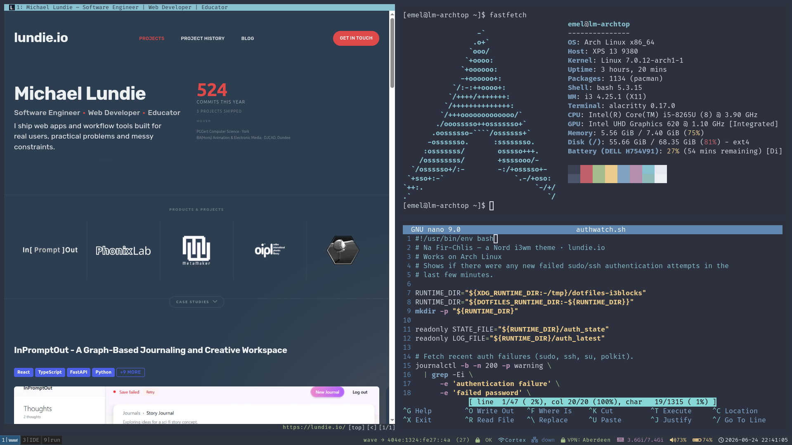
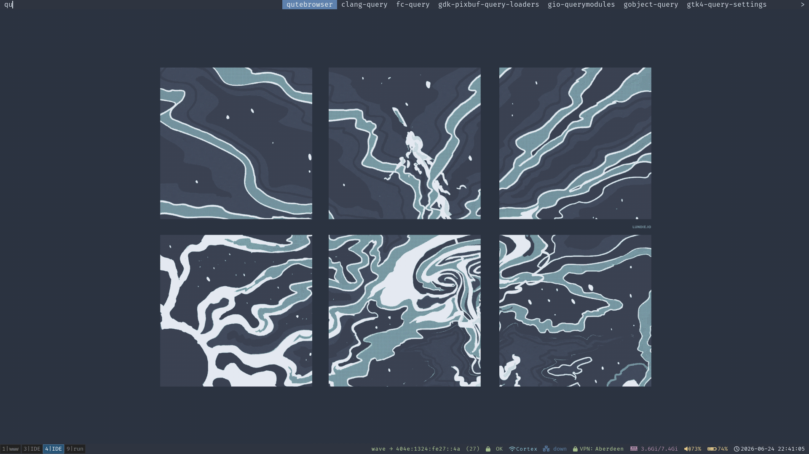
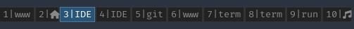
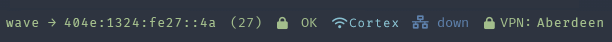
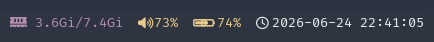
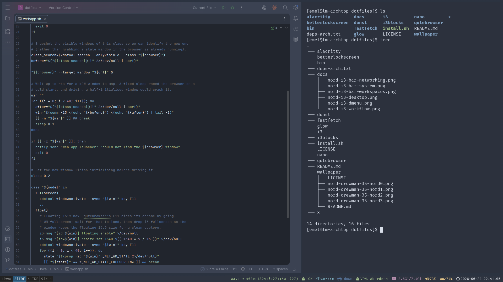

# Na Fir-Chlis – Nord i3wm Theme

*Named for [na fir-chlis](https://gd.wikipedia.org/wiki/Fir_Chlis), the Gaelic "nimble men" – the Merry Dancers, the Scots Gaelic name for the aurora.*

[](https://github.com/michael-lundie/na-fir-chlis/actions/workflows/checks.yml)
[](LICENSE)
[](https://creativecommons.org/licenses/by-nc-nd/4.0/)

A clean, reproducible [i3](https://i3wm.org/) window-manager setup for Arch Linux, themed end-to-end with the [Nord](https://www.nordtheme.com/) palette.
Managed with [GNU Stow](https://www.gnu.org/software/stow/) so it deploys (and un-deploys) with a single command.

> This is a minimal, keyboard-driven setup I use across my laptops and desktop.
> The goal is clean, low-overhead functionality – a fast tiling WM, a themed bar, and no desktop-environment bloat.
> Fork it, copy a piece, or use it as a starting point for your own setup.

## Screenshots

The full desktop – qutebrowser, Alacritty running `fastfetch` and nano:



The Nord-themed dmenu launcher (`Super+d`) and the included wallpaper:



The i3blocks status bar (the screenshots below are split into sections).

The workspace shelf:



The networking blocks – network peers, auth watch, Wi-Fi, ethernet and VPN (IP and SSID shown here are placeholder examples):



The system blocks – memory, volume, battery and clock:



The setup in use – Nord-themed WebStorm on the left (theme not included):



## Features

- **Window manager:** i3 with gaps, a clean borderless layout, and (optional) IBus Japanese-input toggles.
- **Workspace routing:** when exactly two monitors are connected, odd-numbered workspaces go to the secondary display and even-numbered workspaces go to the primary display.
- **Status bar:** i3blocks with custom Nord-themed scripts – battery, volume, memory, network/VPN monitor, auth-failure watch, and a built-in pomodoro timer.
- **Terminal:** Alacritty with a Nord colour scheme and FiraCode Nerd Font, plus a Nord-themed `fastfetch` config for an on-demand system summary.
- **Launcher:** dmenu, themed with the Nord palette and FiraCode Nerd Font to match the bar.
- **Markdown:** a hand-built Nord [glamour](https://github.com/charmbracelet/glamour) stylesheet, exported once through `GLAMOUR_STYLE` so glow, `gh`, and `glab` all render Nord.
  The export lives in `x/.xinitrc`, so it covers everything launched from the i3 session – bare TTYs and SSH logins won't pick it up.
- **Notifications:** Dunst, styled to match (Papirus icons, Nord urgency colours).
- **One-command install** with automatic backup of any conflicting files.

## Repository layout

Each top-level directory is a Stow *package* – its layout mirrors `$HOME`:

| Path                | Deploys into `$HOME`                             |
| ------------------- | ------------------------------------------------ |
| `install.sh`        | the stow-based installer (see below)             |
| `deps-arch.txt`     | Arch package list                                |
| `i3/`               | `.config/i3/config`                              |
| `i3blocks/`         | `.config/i3blocks/config`                        |
| `dunst/`            | `.config/dunst/dunstrc`                          |
| `alacritty/`        | `.config/alacritty/alacritty.toml` + `nord.toml` |
| `fastfetch/`        | `.config/fastfetch/config.jsonc`                 |
| `qutebrowser/`      | `.config/qutebrowser/config.py`                  |
| `betterlockscreen/` | `.config/betterlockscreen/betterlockscreenrc`    |
| `bin/`              | `.local/bin/*.sh` (status blocks, pomodoro, ...) |
| `nano/`             | `.config/nano/nanorc`                            |
| `glow/`             | `.config/glow/glow.yml` + `nord.json`            |
| `x/`                | `.xinitrc`                                       |

## Installation

```bash
# 1. Clone
git clone <your-repo-url> ~/dotfiles
cd ~/dotfiles

# 2. Install dependencies (official repos)
./install.sh --deps
#   qutebrowser (official) drives the custom Super+b / Super+c web-app
#   launchers; it is installed by --deps. Swap it for another browser via
#   `set $browser` in i3/.config/i3/config.
#   AUR extras (optional):    yay -S betterlockscreen nordvpn-bin
#                             betterlockscreen is the Nord lock screen (pulls in
#                             i3lock-color, replacing i3lock); see Lock screen below
#                             nordvpn-bin is only for the VPN status block

# 3. Deploy the configs (creates symlinks into $HOME)
./install.sh                 # all packages
./install.sh i3 dunst        # or a custom selection
```

`install.sh` is **non-destructive**: Stow never overwrites real files, and any pre-existing config that would conflict is moved to `~/.dotfiles-backup/<timestamp>/` before linking.
Re-running is safe.

> **On other distros:** deploying the configs is just GNU Stow, so `./install.sh` (and selections like `./install.sh i3 dunst`) works anywhere.
> Only `--deps` and `--jp` assume Arch (`pacman`/AUR); on other systems they exit with a note to install the `deps-arch.txt` equivalents yourself, then re-run without the flag.

To remove the symlinks again:

```bash
./install.sh --unstow        # all, or name packages: ./install.sh --unstow i3
```

## Custom keybindings (Super = `$mod`)

| Keys                                | Action                                                              |
|-------------------------------------|---------------------------------------------------------------------|
| `Super+d`                           | Open the application launcher (Nord-themed dmenu)                   |
| `Super+b`                           | Open a web app fullscreen in a new qutebrowser window               |
| `Super+c`                           | Open a web app as a centred floating 16:9 window for screen capture |
| `Super+Shift+x`                     | Lock the screen now (blurred Nord lock via betterlockscreen)        |
| `Super+Shift+w`                     | Sync the lock-screen image to the current wallpaper                 |
| `Super+Shift+i` / `Super+Shift+u`   | Switch IBus input to Japanese / English                             |
| `Print`                             | Screenshot whole screen → `~/Pictures`                              |
| `Shift+Print`                       | Screenshot a selected area                                          |
| `Ctrl+Print`                        | Screenshot the active window                                        |
| `XF86Audio*` / `XF86MonBrightness*` | Volume / brightness (refreshes the i3blocks volume block)           |

> **Before you use it:** `Super+b` / `Super+c` opens my website by default.
> Edit `set $webapp_url https://lundie.io` in `i3/.config/i3/config` to point at your own dashboard/webmail.
> All other bindings are stock i3 defaults plus the `resize` mode – see the comments in the config.

If exactly two monitors are connected, `~/.local/bin/i3-workspace-outputs.sh` assigns odd-numbered workspaces to the non-primary output and even-numbered workspaces to the primary output at i3 startup and restart.

## i3blocks status scripts

All status blocks live in `bin/.local/bin/` and emit Nord-coloured [pango](https://docs.gtk.org/Pango/pango_markup.html) markup.

> The icons in this section are emoji stand-ins so they render on GitHub – the live bar uses [FiraCode Nerd Font](https://www.nerdfonts.com/) glyphs.

| Icon | Script                               | Shows                                                                                  |
|------|--------------------------------------|----------------------------------------------------------------------------------------|
| 🔋   | `battery-status.sh`                  | Battery level, with a charge icon and colour graded by level                           |
| 🔊   | `volume-status.sh`                   | PulseAudio/PipeWire volume, or `MUTE`                                                  |
| 🛡️  | `vpn-status.sh`                      | NordVPN server + IP when connected, else `VPN: off`                                    |
| 🌐   | `netdetail-rotating.sh`              | External connections as `process → peer-IP` (see [Network monitor](#-network-monitor)) |
| 🔒   | `authwatch.sh`                       | Recent failed authentication attempts (see [Auth watch](#-auth-watch))                 |
| 📶   | `wireless-status.sh`                 | Active Wi-Fi SSID, or `down` when no wireless link is up                               |
| 🔌   | `ethernet-status.sh`                 | IPv4 address of the active wired interface, or `down`                                  |
| 🍅   | `pomodoro.sh` / `pomodoro-status.sh` | 25-minute pomodoro timer (`pomodoro.sh start\|stop\|toggle`)                           |

Two blocks are inline one-liners in the i3blocks config rather than scripts: memory usage 🧠 and the clock 🕐.

i3blocks refresh signals: **RTMIN+1** = volume block, **RTMIN+2** = pomodoro block.

Runtime state for the helper scripts defaults to `${XDG_RUNTIME_DIR:-~/.cache}/dotfiles-i3blocks`.
If you want to override that location, export `DOTFILES_RUNTIME_DIR` before starting i3.

### 🔒 Auth watch

`authwatch.sh` scans the recent journal for failed authentication attempts – `sudo`, `ssh`, `su` and `polkit` – and reports one of three states:

| State              | Colour | Meaning                                                     |
|--------------------|--------|-------------------------------------------------------------|
| 🔒 `OK`            | green  | no auth failures in the scanned window                      |
| ⚠️ `N fails`       | amber  | past failures present, but nothing new since the last check |
| ⚠️ `NEW auth fail` | red    | a new failure appeared since the last check                 |

A failed SSH login from the network shows up here (it logs as a failed password), so a sudden red flag is worth a glance.
But it's deliberately broad: your own mistyped `sudo` password trips it too, and it only scans the last 200 lines of the current boot's journal.
Treat it as an at-a-glance awareness indicator, not intrusion detection.

### 🌐 Network monitor

`netdetail-rotating.sh` rotates through your machine's **external** connections, one per refresh, shown as `process → peer-IP` with a live count.
Private, loopback, link-local and multicast addresses are filtered out (IPv4 and IPv6), so only genuinely outbound peers appear.
It flashes red for 10 seconds – and appends to `~/.local/share/i3blocks/netlog.txt` – whenever a new, non-allowlisted peer shows up.

On a busy machine, browsers and sync tools open new external connections constantly, so an unfiltered "new peer" flash is mostly noise.
To suppress the expected ones, copy `.config/i3blocks/netdetail-allow.example.txt` to `netdetail-allow.txt` and add peers/processes you trust – one per line, matched by IP prefix (`52.39.`), full IP, or exact process name (`qutebrowser`).
Allowlisted peers are still shown but never flash.
Override the path with `DOTFILES_NETDETAIL_ALLOWLIST` if you prefer.

> Treat this block as an **awareness widget**, not intrusion detection: it shows what your machine is talking to, but a raw IP without context can't tell a CDN from a threat.
> The process column and allowlist make it useful at a glance; real monitoring is a different tool.

## Laptop vs desktop notes

The battery block and brightness binds are laptop-oriented;
`battery-status.sh` exits cleanly when no `BAT*` device is present, so it's safe to leave the block in on a desktop (or just delete the `[battery]` block from the i3blocks config).

**Per-machine Alacritty font size.** Font size depends on the monitor's DPI, so the shared `alacritty.toml` leaves it unset and imports `~/.config/alacritty-local.toml` (untracked, one per machine).
Absent that file, Alacritty falls back to its built-in default (11.25pt), which on a 1080p laptop looks oversized – so create one on each new machine:

```bash
printf '[font]\nsize = 7.0\n' > ~/.config/alacritty-local.toml
```

Alacritty live-reloads, so just tweak the number and save until it's right (7 suits a 1080p laptop here; bump it up for a HiDPI desktop).
Nothing breaks if the file is missing – you only lose the per-machine size.

**Wallpaper.** i3 doesn't set one; `feh` does. The default is my own painting, *"Escape"*, painted in 2023 and recoloured for Nord.
It is shipped in four Polar Night grounds (`nord0`–`nord3`) in [`wallpaper/`](wallpaper/); the `nord0` cut applies on start, so a fresh clone looks complete out of the box.
To use a lighter ground, or a different image entirely, on a given machine:

```bash
feh --bg-fill ~/Pictures/your-wallpaper.jpg   # also: --bg-scale / --bg-max / --bg-center
```

That writes `~/.fehbg`, which **takes precedence** over the shipped default and stays per-machine (untracked).
Both paths no-op silently if absent, so nothing breaks before a wallpaper exists.
The shipped default is resolved relative to wherever you cloned the repo, so no fixed install path is assumed.
Set `DOTFILES_WALLPAPER` to point both the start-up wallpaper and the lock screen at an image of your choosing.

There is a collection of nord themed wallpapers available at [linuxdotexe/nordic-wallpapers](https://github.com/linuxdotexe/nordic-wallpapers) – browse there for other Nord-themed backgrounds.

**Lock screen.** [`betterlockscreen`](https://github.com/betterlockscreen/betterlockscreen) (AUR) renders a blurred, dimmed lock themed via the tracked `~/.config/betterlockscreen/betterlockscreenrc`.
`xss-lock` locks on idle (5 min, set by `xset s` in the i3 config), on suspend, and on `Super+Shift+x`.
It locks against a **cached** image, which `~/.local/bin/betterlockscreen-sync.sh` keeps in step with the desktop wallpaper – it re-bakes the cache at i3 start (only when the wallpaper actually changed) and on demand via `Super+Shift+w`.
So the lock screen tracks whatever `feh` is showing, with no manual `betterlockscreen -u` step.

## Troubleshooting

### Flameshot hangs on a bare WM

The `Print` bindings above use `scrot`, so this setup is unaffected out of the box.
But if you swap in [Flameshot](https://flameshot.org/) on a minimal X11 WM (i3, dwm, xmonad – anything started via `startx`), capture can hang for ~30 seconds before timing out.

The cause is upstream, not a config problem.
Flameshot (v14+) routes screenshots through the XDG desktop portal, but `xdg-desktop-portal-gtk` advertises no `Screenshot` interface – so the call waits out the full timeout with nothing to answer it.
See [flameshot-org/flameshot#4737](https://github.com/flameshot-org/flameshot/issues/4737).

The fix is to skip the portal and grab via X11 directly – set this in `~/.config/flameshot/flameshot.ini`:

```ini
[General]
useX11LegacyScreenshot=true
```

This is a per-machine runtime workaround, not a dotfile, so it is deliberately left out of the tracked configs.

## Dependencies

See [`deps-arch.txt`](deps-arch.txt).
Core: `i3-wm`, `i3blocks`, `i3status`, `dunst`, `alacritty`, `fastfetch`, `qutebrowser`, `ttf-firacode-nerd`, `papirus-icon-theme`.
Plus the usual i3 helpers (`brightnessctl`, `scrot`, `xdotool`, `dex`, `xss-lock`, `network-manager-applet`, `dmenu`, `libnotify`, `iproute2`, `procps-ng`, `xorg-xrandr`).
Optional AUR packages: `betterlockscreen` for the Nord lock screen (pulls in `i3lock-color`, replacing `i3lock`), and `nordvpn-bin` for the VPN block.

## About

Built and maintained by Michael Lundie · [lundie.io](https://lundie.io).

A Nordic theme, made in Japan by a Scotsman.

## Licence

- **Code** (scripts, configs, installer): MIT – see [`LICENSE`](LICENSE).
- **Artwork** (the paintings in [`wallpaper/`](wallpaper/)): © Michael Lundie, licensed [CC BY-NC-ND 4.0](https://creativecommons.org/licenses/by-nc-nd/4.0/) – share with attribution, no commercial use, no derivatives.
